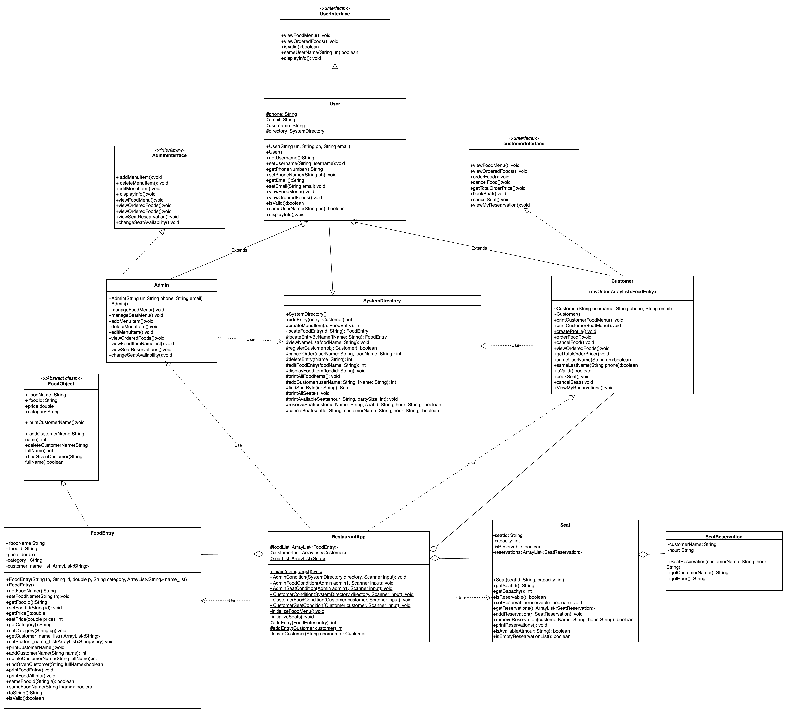
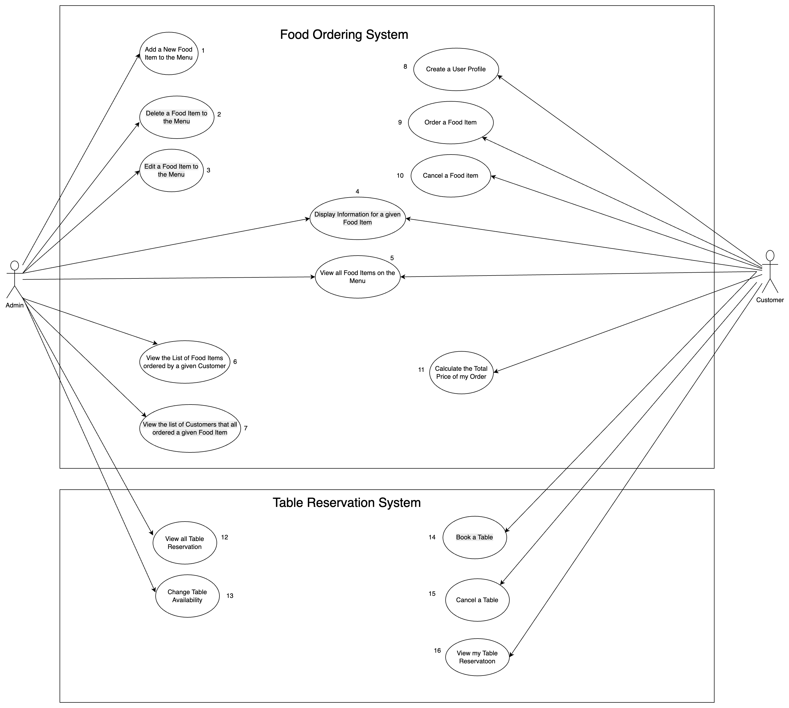

# 🍽️ Restaurant Ordering and Seat Booking System

A console-based Object-Oriented Java application designed to help restaurants manage food orders and table reservations efficiently. The system supports two types of users—**Admin** and **Customer**—each with tailored functionalities for menu management, food ordering, and seat booking.

---

## 📌 Features

### 👤 Admin Functionalities
- Add, delete, and edit food items in the menu.
- View details of all menu items.
- View food items ordered by specific customers.
- View the list of customers who ordered a specific dish.
- Manage table availability.
- View all table reservations.

### 🙋 Customer Functionalities
- Create a user profile.
- View menu and order food items.
- Cancel food items from orders.
- View and calculate total order price.
- Book and cancel table reservations.
- View personal reservation history.

---

## 🧱 System Architecture

The system is built following **Object-Oriented Programming (OOP)** principles with the following structure:

- `RestaurantApp`: Main application controller with `main()` method.
- `Admin`, `Customer`: User roles inheriting from a base `User` class.
- `SystemDirectory`: Service layer for managing food entries, customer data, and seat operations.
- `FoodEntry`, `Seat`, `SeatReservation`: Core domain entities.
- Interfaces: `UserInterface`, `AdminInterface`, `customerInterface` for role-specific behaviors.

All operations are performed in-memory using `ArrayList` structures.

---

## 📋 Class Diagram



---

## 🧾 Use Case Diagram



Detailed use case descriptions are available in [`Usecases_Description.docx`](./Usecases_Description.docx).

---

## ▶️ How to Run

1. Clone the repository:
   ```bash
   git clone https://github.com/yourusername/OOP_Final_Project_25Spring.git
